###关于如何用github搭建自己的网站（博客）

创建简易版网站
-

一般来说搭建一个网站至少需要以下及格条件：

* 域名
* 服务器
* 前端（html、css和js）
* 后端（php、java、asp、c++或python等）

而搭建一个可以直接输入链接到浏览器地址栏回车就可以显示的简陋页面却不需要那么复杂，github会提供免费的github.io后缀域名和免费仓库服务器，接下来我会说个小白的搭建方式，跟着操作步骤保证各位都能顺利搭建成功：

**1. 申请注册一个github账号（已有的请跳过该步骤）**

**2. 创建一个名为<username>.github.io的repo**

该repo的名字，必须保持格式<username>.github.io，其中<username>替换成你的github账户名，我的账户名（<username>）是centuryHarbour，以后的我将以这账户名来写例子，各位只要看到这名字的修改成自己的账户名就好，具体如下图所示：

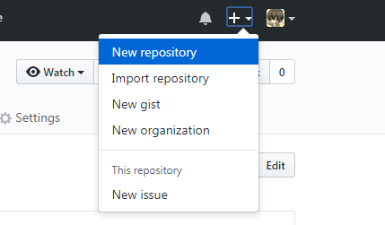

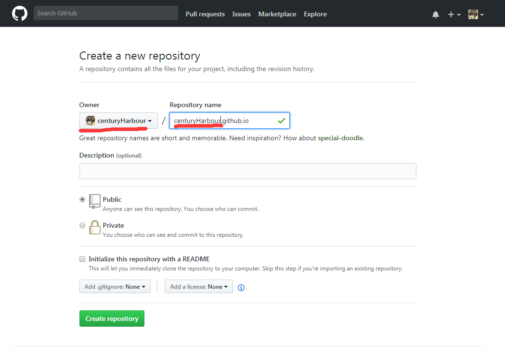

**3. git clone 下来**

* 不会git的童学可以学习廖雪峰大神的git教程，但是这里你只要安装好git就行，可以从Git官网直接下载[安装程序](https://git-scm.com/downloads)，（网速慢的同学请移步[国内镜像](https://pan.baidu.com/s/1kU5OCOB#list/path=%2Fpub%2Fgit)），然后按默认选项安装即可（已有的童学可跳过该步骤）。

* 在电脑上（可以桌面也可以d盘或其他盘）创建一个文件夹（最好英文命名），比如我的文件夹是git-clone，然后右键打开git bash窗口，如下所示：

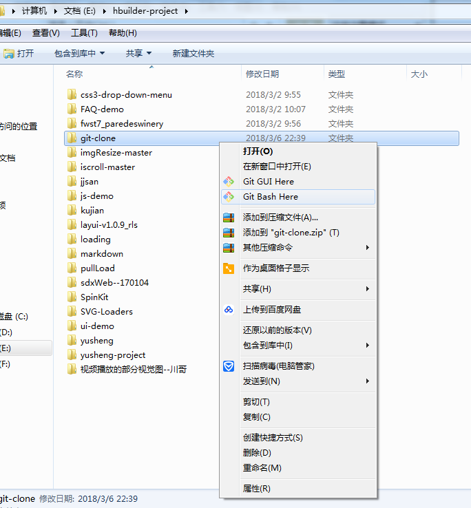

* 在打开的git bash窗口上执行以下命令（以下有centuryHarbour的名字请都改成自己的）：

	git clone https://github.com/centuryHarbour/centuryHarbour.github.io

* clone成功后会有一个centuryHarbour.github.io的文件夹

**4. 执行如下命令创建简易版显示网页**

（以下有centuryHarbour的名字请都改成自己的）

	cd centuryHarbour.github.io
	echo "Hello World!" > index.html
	git add .
	git commit -m "git提交代码的说明"
	git push origin master

*Note：*执行push这命令的话会要求你输入github的账户名，输入github账户名后回车会弹出提示框要求输入该github账户的密码

参照图：

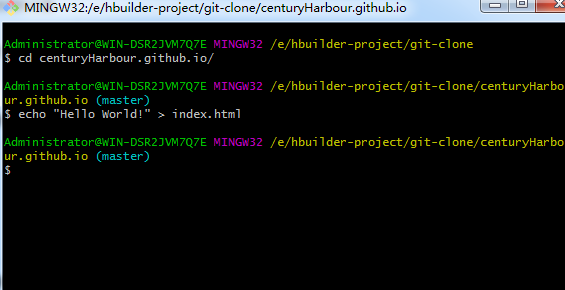

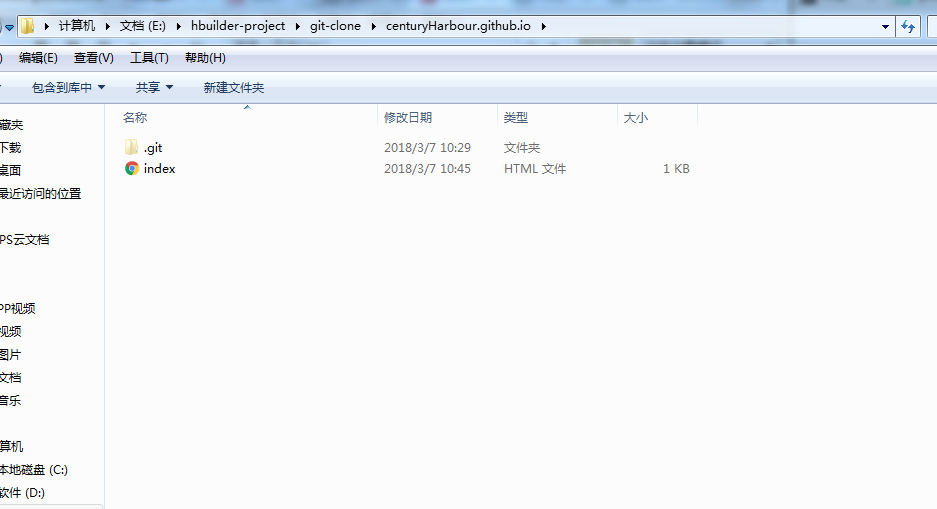

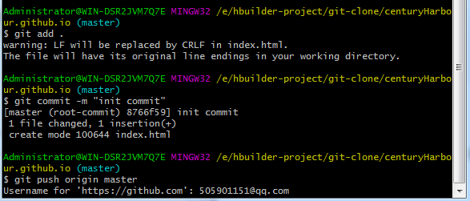

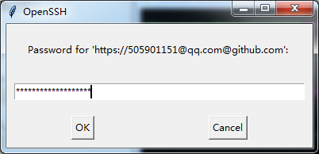

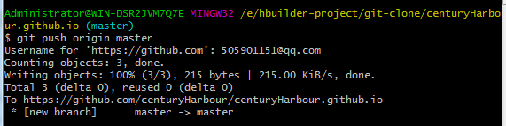

**浏览器打开链接，简易版网站就做好了**

一般第一次上传完了会有右键提示你，如果没有就要稍微等那么一会（一分钟左右）才能浏览（以下有centuryHarbour的名字请都改成自己的）

上传成功一般会再你github仓库创建一个centuryHarbour.github.io仓库，里面会有你的创建的网页index.html，要是以后想自己玩自定义，就可以在这个仓库放你网页文件等其它相关文件

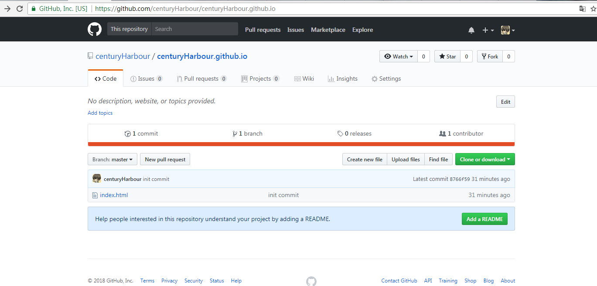

浏览器地址栏输入网址：\https://centuryHarbour.github.io，如下图所示\：

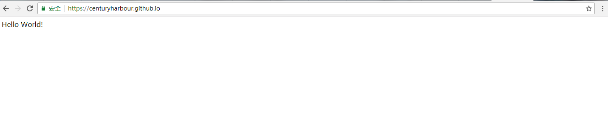

利用网上已有的模版创建博客
-

github.io默认采用Jekyll作为建站工具。Jekyll是一款很热火的开源静态建站工具，拥有很庞大的社区和使用人群，有很丰富的插件和主题，已经有很多人造好轮子供你参考使用了，所以你只要有点前端功底就可以没什么好担心地去使用了，但是你要想设计好看那你就要有一定的设计功底了，这里我使用一个博客模版作为使用案例：

**clone开源的博客主题模版**

clone[下载模版](https://github.com/xudailong/xudailong.github.io)，操作如下图所示：

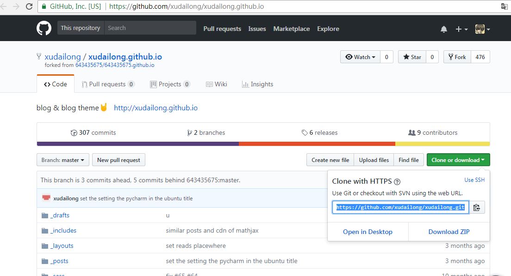

你可以创建一个文件夹，或是在你直接使用刚才创建的那个文件夹，比如我的事git-clone，我的clone下载的都会放这里，操作步骤还是跟刚开始一样在这个文件夹右键打开git bash，或是你创建简易版网站时还没关掉git bash，那你可以直接执行以下命令：

	cd ../

这时候git bash窗口是处于git-clone文件夹的，如图所示：

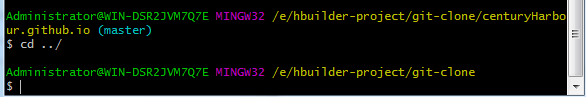

然后执行如下命令clone模版下来：

	git clone https://github.com/xudailong/xudailong.github.io.git
	
下载完成后参考图：

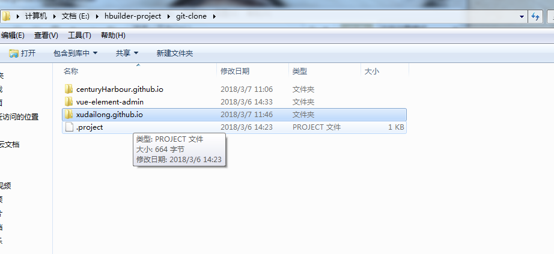

**git关联网站的仓库，修改代码**

clone下来模版后，我们就得关联自己刚才创建的网站仓库，比如我的是centuryHarbour.github.io，然后执行以下代码（以下有centuryHarbour的名字请都改成自己的）：

	cd xudailong.github.io
	git remote add mine git@github.com:centuryHarbour/centuryHarbour.github.io.git
	git remote -v
	
*Note：*git remote -v 是查看所关联的仓库,git remote add mine \git@github.com:centuryHarbour/centuryHarbour.github.io.git\是增加一个mine的git主干名关联的是\git@github.com:centuryHarbour/centuryHarbour.github.io.git\仓库

然后用Notepad++编辑器或是其他编辑器也可以（Notepad++网上搜索下载直接全部下一步安装就好）打开xudailong.github.io的文件夹里的_config.yml文件修改，具体可以参照[xudailong.github.io文档说明](https://github.com/Gaohaoyang/gaohaoyang.github.io/blob/master/README-zh-cn.md)去修改你想修改的东西,这里我只是随便选的_config.yml文件修改演示看看效果（修改的文件记得按ctrl + s保存一下）。

操作细节等参考下图：

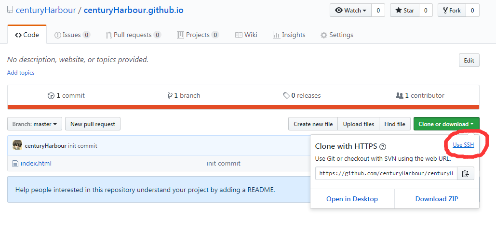

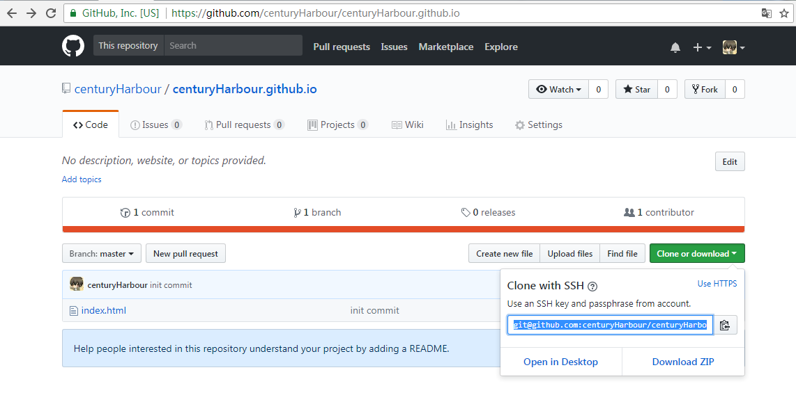

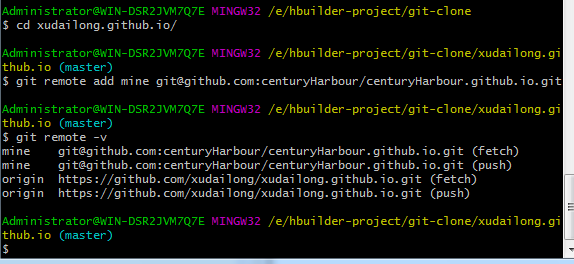

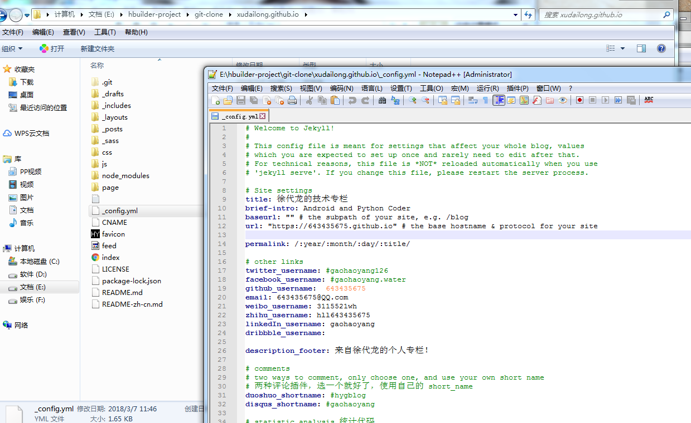

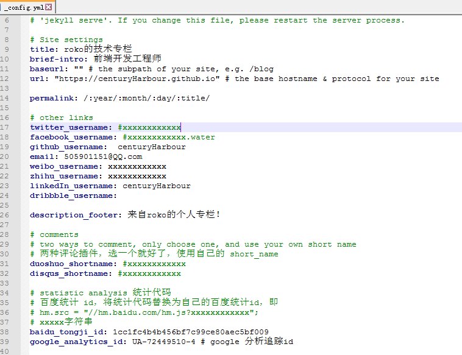

**上传代码，显示博客**

做完以上修改步骤后，就要上传代码到自己的网站仓库了，执行以下命令：

	git add .
	git commit -m "git提交代码的说明"
	git push mine master -f

*Note：* -f是强制提交到mine远程仓库，这种push做法虽然暴力了点，但是能达到索要的效果就好，为什么这么做呢？因为我们所在的这个文件夹的仓库内容跟远程mine的仓库内容不一致，有兴趣的童学可行百度。

参考操作：

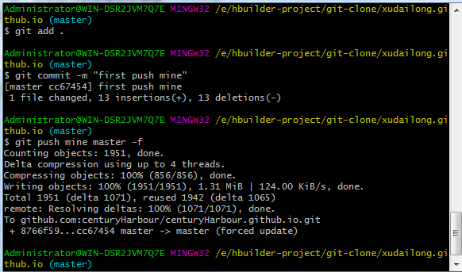

浏览器地址栏输入网址：\https://centuryHarbour.github.io，如下图所示\：

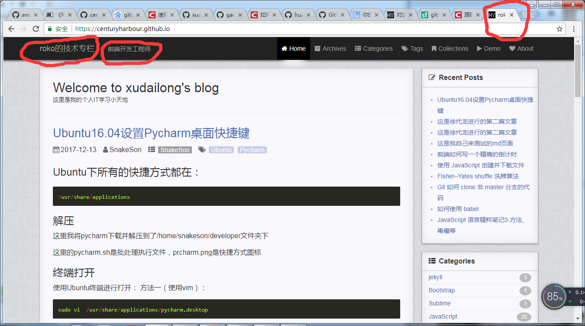
