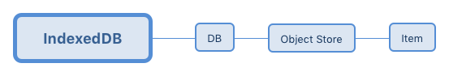

##常见indexDB的使用

为什么要使用indexDB呢，当我们需要在本地永久存储大量的数据或需要符合一定规范的时候用到，当数据量不多时当然选择SessionStorage或LocalStorage是最好不过，cookie也是一种存储数据的方式但是不大只用4kb并且可以设置有效期，而SessionStorage和LocalStorage可达5M存储量。
 
indexed结构
-

indexedDB的整体结构如下图所示：

相对与spl型数据库，indexedDB中的DB（数据库）就是sql中的DB，而Object Store（存储空间）则是数据表，item则等于表中的一条记录

使用indexedDB
-

根据indexedDB的结构主要要做以下几个操作：

* 数据库操作
* 数据表操作
* 数据操作

**数据库操作**

1. 创建或打开一个数据库

* window.indexedDB.open(DB-name)	这api是打开操作，示例：

	const request = window.indexedDB.open('test');
	request.onupgradeneeded = function(e) {
		
	}
	request.onsuccess = function(e) {
		// request === e.target
	}
	request.onerror = function(e){
		
	}

调用此接口时，若当前数据库不存在，则会创建一个新的数据库。

当数据库建立链接时，会返回一个IDBOpenDBRequest对象。

连接建立成功时，会触发onsuccess事件，其中函数参数e的target属性就是request对象

而在数据库创建或是版本更新时，会触发onupgradeneeded事件。

* 更新数据库版本号

window.indexedDB.open 的第二个参数为版本号，在不指定的情况下，默认版本号为1。示例如下：

	const request = window.indexedDB.open('test', 2)
	
在需要更新数据库的schema（模式）时，需要更新版本号。此时我们制定一个高于之前版本的版本号，就会触发onupgradeneeded事件。类似的，当次数据库不存在时，也会触发此事件，并且将版本更新到置顶版本。

*Note：*版本号是一个unsigned long long 数字，这意味着它可以是非常大的整数。但是它不能是小数，否则它将被转为最近的整数，同时有可能导致onupgradeneeded事件触发不了。

**存储空间操作**

* 创建存储空间

使用createObjectStore来创建一个存储空间。同时，使用createIndex来创建它的索引。示例如下：

	var request = window.indexedDB.open('test', 1);
	request.onupgradeneeded = function(e) {
		var db = e.target.result;
		var objectStore = db.createObjectStore(tab1, {
			keyPath: 'id',
			autoIncrement: true
		});
		objectStore.createIndex('name', 'name', {unique: false});
	}
	request.onerror = function(e) {
		alert("why didn't you allow my web app to use indexedDB?");
	}

*Note：* 只能在onupgradeneeded回调函数中创建存储空间，而不能在数据库打开后的success回调函数中创建。

通过createObjectStore能够创建一个存储空间。接受两个参数：

1. 第一个参数，存储空间的名称，既我们上面的customers (tab1)。

2. 第二个参数，指定存储的key值为存储对象的某个属性，这个属性能够在获取存储空间数据的时候做key值使用。autoincrement 指定了key值是否自增（当key值为默认的从1开始到2^53的整数时）。

而createIndex能够给当前的存储空间设置一个索引。它接受三个参数：

1. 参数1，索引的名称。

2. 参数2，指定根据存储数据的哪一个属性来构建索引。

3. 参数3，options对象中，其中属性unique的值为true表示不允许索引值相等。

**数据操作**

* 事务

在indexedDB中，我们也能够使用事务来进行数据库的操作。事务有三个模式（常量已经弃用）：

	1. readOnly，只读；
	2. readWrite，只写；
	3. versionchange，数据库版本变化。

我们创建一个事务时，需要从上面选择一种模式，如果不指定的话，则默认认为只读模式。示例如下：

	const transaction = db.transaction(['customers'],"readWrite");
	
事务函数transaction的第一个参数为需要关联的存储空间，第二个可选参数为事务模式。与上面类似，事务成功时也会触发onsuccess函数，失败时触发onerror函数。

*Note：* 事务的操作都是原子性的。

**增加数据**

当存储空间初始化完成后，我们可以把数据放入存储空间内，示例如下：

	var request = window.indexedDB.open('test', 1);
	request.onsuccess = function(e) {
		var db = e.target.result;
		var transaction = db.transaction(['tab1'], 'readWrite');
		var objectStore = transaction.objectStore('tab1');
		var index = objectStore.index('name');
		
		objectStore.add({name: 'a', age: 10});
		objectStore.add({name: 'b', age: 20});
	}
	
*Note：* add方法中是第二参数key值是指定存储空间中的keyPath值，如果data中包含keyPath值或者此值为自增值，那么可以略去此参数。

**查找数据**

* 通过特定值获取数据

当我们需要从存储空间获取数据时，我们可以通过以下的方法：

	var request = window.indexedDB.open('test', 1);
	request.onsuccess = function(e) {
		var db = e.target.result;
		var transaction = db.transaction(['tab1'], 'readWrite');
		var objectStore = transaction.objectStore('tab1');
		var request = objectStore.get(1);
		request.onsuccess = function(e) {
			// 对request.result做些操作!
			console.log(request.result);
		}
		request.onerror = function(e) {
			// 错误处理!
		}
	}
	
* 通过游标获取数据

当你需要便利整个存储空间中的数据时，你就需要使用游标。游标使用方法如下：

	var request = window.indexedDB.open('test', 1);
	request.onsuccess = function(e) {
		var db = e.target.result;
		var transaction = db.transaction(['tab1'], 'readWrite');
		var objectStore = transaction.objectStore('tab1');
		var request = objectStore.openCursor();
		request.onsuccess = function(e) {
			var cursor = e.target.result;
			if(cursor) {
				// 使用Object.assign方法是为了避免控制台打印时出错
				console.log(Object.assign(cursor.value));
				cursor.continue();
			}
		}
		request.onerror = function(e) {
			// 错误处理!
		}
	}
	
*Note：* 使用游标时要注意，当游标遍历整个存储空间但是并未找到给定条件的值时，仍然会触发onsuccess函数。

openCursor和openKeyCursor有两个参数：

1. 参数1，遍历范围，指定游标的访问范围。该范围通过一个IDBKeyRange参数的方法来获取。

遍历范围参数示例如下：

	// 匹配 key === 1
	const singleKeyRange = IDBKeyRange.only(1);
	
	// 匹配值 key >= 1
	const lowerBoundKeyRange = IDBKeyRange.lowerBound(1);
	
	// 匹配值 key > 1
	const lowerBoundOpenKeyRange = IDBKeyRange.lowerBound(1, true);
	
	// 匹配值 key < 2
	const upperBoundOpenKeyRange = IDBKeyRange.upperBound(2, true);
	
	// 匹配值 key >= 1 && key < 2
	const boundKeyRange = IDBKeyRange.bound(1, 2, false, true);
	
	index.openCursor(boundKeyRange).onsuccess = function(e) {
		const cursor = e.target.result;
		if(cursor) {
			// do something with the matches.
			cursor.continue();
		}
	}

2. 参数2，遍历顺序，指定游标遍历时的顺序和处理相同id（keyPath属性指定字段）重复时的吹方法。改范围通过特定的字符串（IDBCursor的常量已经弃用）来获取。其中：

* next，从前往后获取所有数据（包括重复数据）

* prev，从后往前获取所有数据（包括重复数据）

* nextunique，从前往后获取数据（重复数据只取第一条，索引重复既认为重复）

* prevunique，从后往前获取数据（重复数据只取第一条，索引重复既认为重复）

遍历顺序的示例如下：

	var request = window.indexedDB.open('test', 1);
	request.onsuccess = function(e) {
		var db = e.target.result;
		var transaction = db.transaction(['tab1'], 'readWrite');
		var objectStore = transaction.objectStore('tab1');
		var lowerBoundOpenKeyRange = IDBKeyRange.lowerBund(1, false);
		var request = objectStore.openCursor(lowerBoundOpenKeyRange, IDBCursor.PREV);
		request.onsuccess = function(e) {
			var cursor = e.target.result;
			if(cursor) {
				// 使用Object.assign方法是为了避免控制台打印时出错
				console.log(Object.assign(cursor.value));
				cursor.continue();
			}
		}
		request.onerror = function(e) {
			// 错误处理!
		}
	}
	
**使用索引**

在前面构建书记哭时，我们创建了两个索引。现在我们也可以通过索引来进行数据检索。他的本质还是通过之前获取数据的api来进行，只是将原来使用keyPath属性转换成为了但索引指定的属性。示例如下：

	var request = window.indexedDB.open('test', 1);
	request.onsuccess = fuunction(e) {
		var db = e.target.result;
		var transaction = db.transaction(['tab1'], 'readWrite');
		var objectStore = transaction.objectStore('tab1');
		var index = objectStore.index('name');
		// 第一种，get方法
		index.get('a').onsuccess = function(e) {
			console.log(e.target.result);
		}
		// 第二种，普通游标方法
		index.openCursor().onsuccess = function(e) {
			console.log('openCursor:',e.target.result.value);
		}
		// 第三种。键游标方法，该方法与第二种的差别是：普通游标带有value值表示获取的数据，而键游标没有
		index.openKeyCursor().onsuccess = function(e) {
			console.log('openCursor:',e.target.result);s
		}
	}
	
**修改数据**

当需要修改存储空间中的数据时，我们可以使用以下的api：

	var objectStore = transaction.objectStore("customers");
	var request = objectStore.put(data);
	request.onsuccess = function(e) {
		
	}
	
*Note：* put方法不仅能够修改现有数据，也能够王存储空间中增加新的数据。

**删除数据**

当我们需要删除已经无用的数据时，我们可以通过以下方法实现：

	var objectStore = transaction.objectStore("customers");
	var request = objectStore.delete(name);
	request.onsuccess = function(e) {
		
	}

**异常处理**

在浏览器有如下操作的情况下，indexedDB可能会出现异常：

* 用户清除浏览器缓存
* 存储空间超过大小限制

此时，需要对错误进行捕获，并且对用户进行提示。

扩展须知
-

**取值相关**

* key值能够接受的数据类型

在indexedDB中，键值对中的key值可以接受以下集中类型的值：

	* number
	* data
	* string
	* binary
	* array

具体说明可见[文档说明](https://w3c.github.io/IndexedDB/#key-construct)

* key path能够接受的数据类型

当